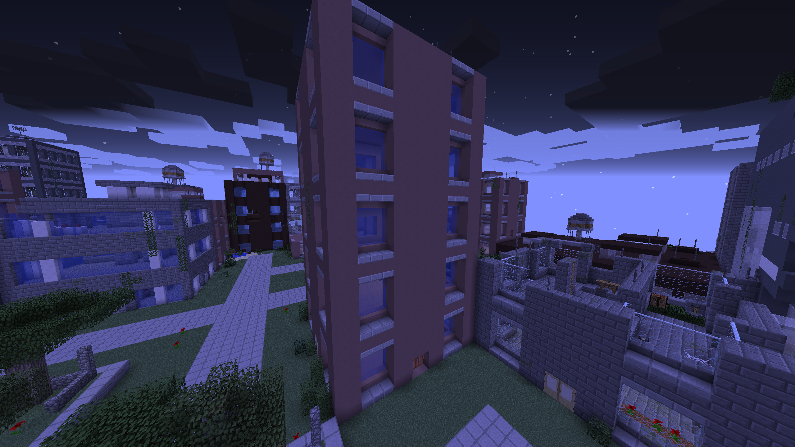
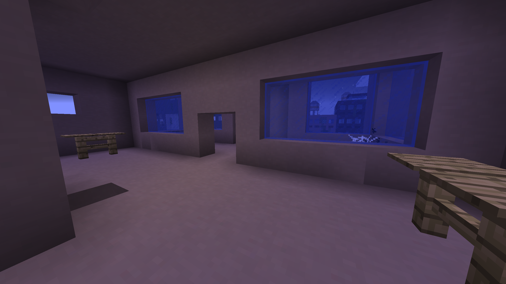
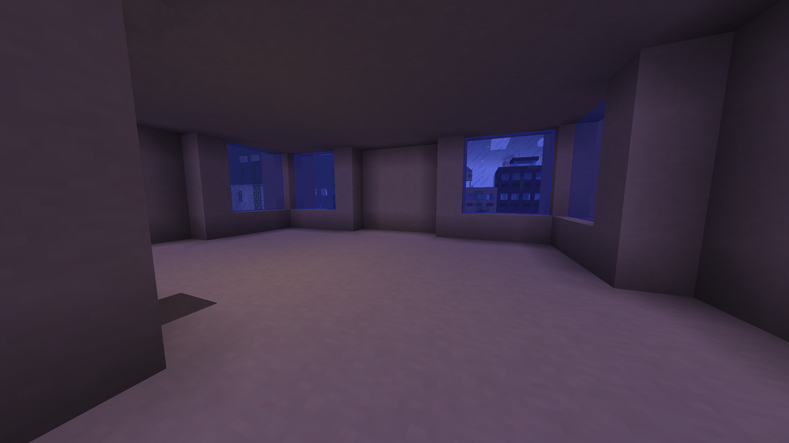

# Spider's base guide

*This guide is to help you get nudged into the making of your base, where your machines and automation are stored, as well as your storage and general everything!*

**Start of your Journey:**

On the start of your journey through OMNIFACTORY(**tm**) having a base preped and planned to 
form your factory is a good idea, but during the start this can be dificult, so from your
very first moment within the game its best to search for a abandoned building to shelter in. Something like the underneath picture is 
a decent start, there are bigger options to find, but they are most likely damaged in a annoying way, so finding
a minimally damage building is a rather nice home.

Some of the floors might be also be filled with undeeded walls, decorations etc. You should clear it, you could
 sort each floor for a specifc thing, like storage, etc! Here is a before and after I removed the interior.
 
 
 
 
 
With your base now picked out, ready for your start, its best to wait until you get access to a good power supply
and the destruction gadget.

**With power + destruction gadget:**

The destruction gadget allows you to destroy blocks easily, be careful when using this, because this tool can
permenatly delete blocks, so be careful not to use this around your important blocks. Something you
can do with this tool is create an underground base, using the destruction gadget can let you delete
a big chunk of underground space without the pain of mining. Then optionally some decoration of the walls, ceeling
and floor. This offers a big space for you to do most of your work across Omnifactory, but what about... Advanced
building?

**Flight/Jetpacks + Effortless building:**

Effortless building is a mod that allows player to have a ranged source of building, at this point of the game you 
should be able to make all of effortless buildings range upgrades, *search @effortless* in jei to see the recipes of
upgrades, and even the randomiser bag, which allows you to randomise block placement. Holding **alt** on your keyboard
 lets a selection menu pop up,  if you  hover over to lets say cube, you can hold right click and drag to draw across
 the x/z axis, then start to drag up once letting go to draw across the Y axis, then right click, mattering on how much
 blocks you have in your hand and inventory it will try to fill the space with the blocks you are holding, it will also
 pull the same blocks from your inventory if available. Getting access to flight, such as jetpacks, can help you massive
 in getting a good view over your build, with effortless building you can make parts of a full scale build in ease.

