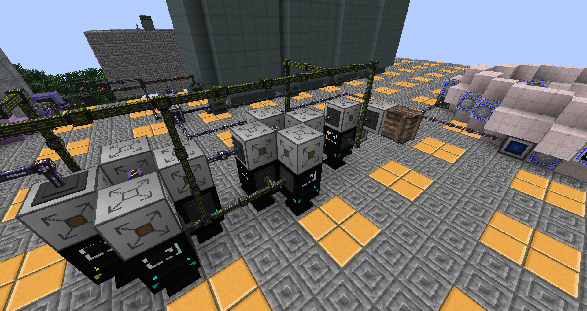
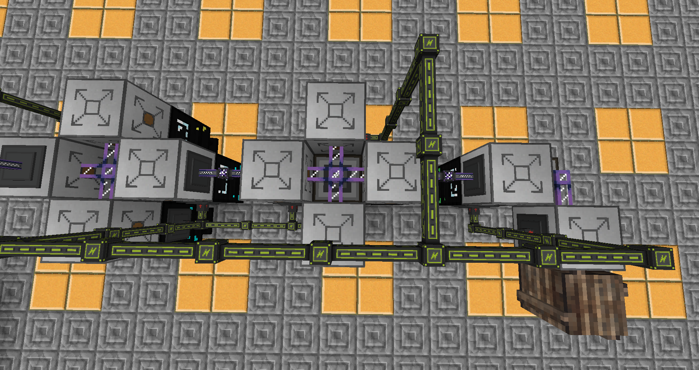

# How to automate extended crafting table recipes

You'll need an Automation Interface, a table of the required size, and an Unpackager for each recipe you need to automate. For some recipes it might be possible to use a normal ME Interface instead of an Unpackager.

Use a packagedAuto Encoder to encode a package recipe holder with the recipe you want to automate - this holder is going into your unpackager. Also encode the same recipe into a holder in one of your packagers - you don't have to dedicate a Packager per recipe, there just needs to be a Packager anywhere in your system that has this recipe in it's holder.

Put down the Unpackager, place the holder with a single recipe in it, and connect it to your ME system.
You'll need to acquire all the items you need for the recipe. The simplest way to do this is to put a crate adjacent to the unpackager and order the item you are trying to automate. This will cause the AE system to craft the required items, send them to your Packager to be turned into one or more packages, and send the resulting packages to your Unpackager. The unpackager will unwrap them and send the results into the adjacent inventory (crate).

Having acquired all the items, put the table down and put an Automation Interface on top of it such that the Automation Interface is adjacent to the Unpackager (remove the crate if you used it). Now put the recipe into the table(you can use JEI for that). Click "Set Recipe" in the Automation Interface. You'll need to connect power to the A.I. too.

Now the Automation interface will automatically assemble the recipe from items input into it by the Unpackager, and grab the result once the recipe is finished. Use either the AI's auto-push function or conduits to have the results be put into your system. Warning: Automation Interfaces are buggy with their I/O, and may void items while pushing or dupe them while pulling if the inventory isn't valid.

## Example setup

The interface between the Automation Interfaces handles the results; the AIs are set to auto-output into it.

