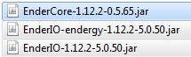

Made for Omnifactory **1.2.1** specifically. **Don't** try to apply it to later versions!

# Installing Unofficial Fixes for Omnifactory 1.2.1

## Introduction

This guide covers the installation of most unofficial fixes for the 1.2.1 version of Omnifactory. Mainly, that's **Exa's fixes**, which are included in the pack itself post-1.2.1. However, there are also many fixes in the form of custom jars, which will not be integrated in the pack in the nearby future, due to Curseforge's review process.

## Steps

This guides assumes you already have 1.2.1 Omnifactory installed. [Link](https://www.curseforge.com/minecraft/modpacks/omnifactory/files/2733453).

### Exa's fixes
Download them from [here](files/UnofficialFixes/Exa_Fixes_20191004.zip) (push the "Download" button), or from a pinned message in #general on the pack's discord server. Follow the README inside the zip for instructions. 

### Mod updates
#### EnderIO
The main thing you should know is that updating EnderIO to the latest version would require also updating forge, which may in itself bring some problems. As such, the guide will tell you how to update to a known to be mostly stable with 1.2.1 version.

You need to update all three mods involved - EnderIO, Endergy (addon adding the tiers of conduits past Vibrant) and EnderCore. The versions suggested are the following:

1. Download the mods. Links: [EnderCore](https://www.curseforge.com/minecraft/mc-mods/endercore/download/2744056), [EnderIO](https://www.curseforge.com/minecraft/mc-mods/ender-io/download/2754866), [Endergy](https://www.curseforge.com/minecraft/mc-mods/ender-io-endergy/download/2754865).
2. Locate your instance's `mods` folder. The exact ways to do so depend on the launcher, but generally there should be a button to open the instance's folder.
3. Find the existing `jar` files of EnderCore, EnderIO-endergy and EnderIO, and delete them. (alternative to deletion is changing the extension from `.jar` to `.jar.disabled`, which will prevent Forge from treating them as mods).
4. Add in the three new jars you've downloaded in step 1.

That's it. Only known problem with the EnderIO update involves inability to obtain Dark Steel Upgrades(they are a new item in that enderio version), but that can be solved by cheating some in - they are only used as blank upgrades for EnderIO armor/tools.

### Third-party fixes
Here we are getting to the *really* unofficial stuff, made by fans of Omnifactory for fans of Omnifactory.
#### Talchas's AE2 fix
A relatively minor change in AE2 logic, optimizing it to not recalculate the entire network if anything changes when AE2 is in channelless mode. [The PR for it to be included into AE2 proper](https://github.com/AppliedEnergistics/Applied-Energistics-2/pull/4220) was rejected, but there have yet to be any known problems from using it. Advantage: *massive* improvement in recalculation times for big channelless AE2 networks. This doesn't affect lag from working, only the freezes when you change something in the network's structure.

[Link to the repo](https://github.com/talchas/Applied-Energistics-2/releases). Download the latest release, replace your AE2 jar with it (similar to the instructions for updating EnderIO). Bonus: if you're a server owner, you can download the release that is named the same as the normal AE2 jar, and if you replace AE2 with it on your server, you won't need to make all your players install the fix to be able to connect - it's serverside-only.