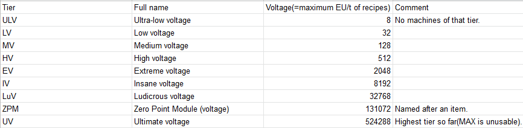
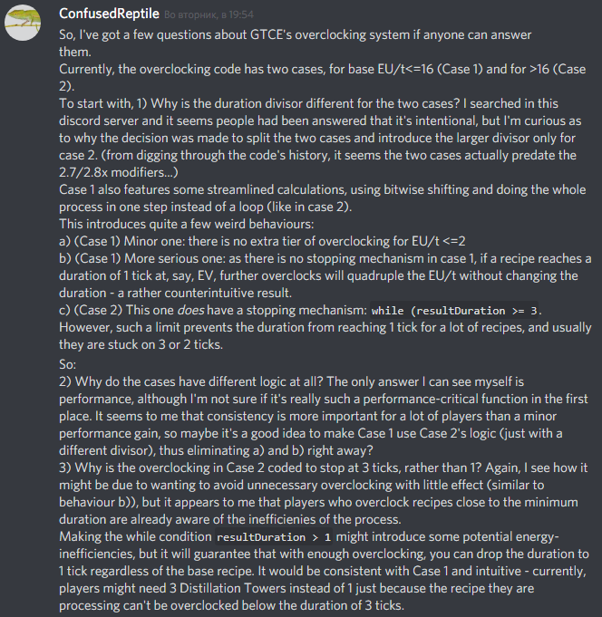

Valid for Nomifactory v.1.2.2
# How overclocking GTCE Machines works
*This guide is written based on the analysis of GTCE code, specifically the [calculateOverclock](https://github.com/GregTechCE/GregTech/blob/30a094585861b70a14cade75460fa89f1dc186af/src/main/java/gregtech/api/capability/impl/AbstractRecipeLogic.java#L239) function. Feel free to check it out yourself.*

Overclocking is a ability of GTCE machines to execute recipes faster at the cost of spending more energy.
A recipe can be overclocked as long as the recipe's base EU/t is less than a quarter of the machine's voltage (which is 32 for LV and quadruples with every tier of the machine). Here's a tier table for reference:
That means an LV machine can only overclock recipes of <=8 base EU/t. An HV(512V) machine is able to overclock recipes of <=128EU/t once, of <=32EU/t _twice_ and of <=8 EU/t _thrice_. Per each tier of overclocking the recipe's duration decreases.

The actual decrease is as follows: 
1) 2x per tier, _if the recipe's base EU/t is 16 or less_.
2) 2.8x per tier otherwise. 

After all the overclocking, if it's not an integer, duration is rounded **down**(but can't go below 1 tick) in the first case and **up** in the second one.

Note that it means that the amount of energy required for the recipe is doubled in the first case and multiplied by about 1.429 in the second. **Overclocking is energy-inefficient**, so you have to decide when you want to use it. Every single-block GTCE machine has a **button** that toggles whether it is allowed to overclock. Multiblocks overclock whenever they can - their tier is dependent on the energy hatches you use in their construction (the controller's GUI states the current voltage tier). There is a limit: a recipe can't be overclocked such that it's duration becomes less than one tick(1/20th of a second). Also: a recipe being <=2EU/t doesn't give another tier of overclocking, for... reasons. 

**Some examples**: 
1. An EV(2048V) Macerator macerating ore(12 EU/t base drain, 20s base duration). The recipe is overclocked 4 times to 768 EU/t(12->48->192->768). Therefore, the recipe's duration will be 8 times lower than normal(2.5 seconds), but the total energy expenditure will be 2.5s*20(ticks per second)*768=38400 EU, which is 8 times higher than the base expenditure(4800 EU).

2. Centrifuging Naquadah dust for Naquadria and Enriched Naquadah. Base recipe is 320 EU/t(HV) and 160s(3200 ticks), 1024000 total EU. In a ZPM Centrifuge, it overclocks 4 times to 81920 EU/t, ~52.06(3200/2.8^4) ticks (rounds up to 53t) (2.65s) duration for a total EU of 53*81920=4341760 EU. This is ~60 times faster than the base recipe, for 4.24x the energy per operation. **Note**: this is a useful recipe (arguably the best way to get naquadria), and you want to use a high-tier machine for it as it increases the byproduct amount (see [the byproduct guide](Byproducts.md) for details).

3. [This calculation by Neeve of the required freezer numbers per cryogenic distillation tower (link to a discord message)](https://discordapp.com/channels/564247906991996928/564247906991996930/666338576157507586)

**Bonus** My questions about overclocking to Archengius, main developer of GTCE, and his answer:

**See also:**
[**Overclocking calculator**](OverclockingCalculator.md)
