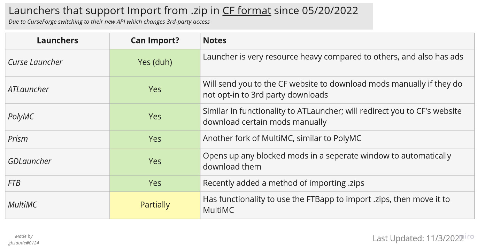

# Playing on Dev

This guide will teach you how to play on development snapshots following the release of 1.2.2.

For the previous version of this guide targeting dev snapshots leading into 1.2.2, use the [1.2.2 revision](https://github.com/Nomifactory/Guides/blob/1.2.2/guides/InstallingUnofficialFixes.md).

## Preliminary Information

### What Are Development Snapshots?

Development snapshots are the bleeding-edge version of Nomifactory. We create a pair of client and server zip files automatically whenever we change the "dev" branch on our GitHub repository.

The main thing to note is that these are experimental builds. They have not been vetted to the same degree as releases. While we make a concerted effort to avoid breaking things, we don't make any guarantees.

If you do find a problem that hasn't been reported yet, please let us know on our issue tracker using the new issue template.

### Can You Update?

Dev snapshots, like releases, support safely upgrading from worlds at most as old as the previous official release. For example, you can safely update from 1.2.2 to the 1.3 dev snapshots, but not directly from 1.2.1.

If your world is older than the current release, please update to each subsequent release first, taking care of anything noted in the release notes before updating to the next version.

### Should You Update?

If you are interested in helping us find and fix bugs, or just simply seeing how things are going towards the next update, feel free.

If you want a stable gameplay experience, prefer the releases.

## Installation

As of December 13, 2022, development snapshots are published as beta releases on CurseForge with "1.3-RC" and a date as their version number. This is now the preferred way to get development builds unless you have a specific need to use snapshots.

Since we use an automatic build system, installation is nice and simple. Just download the client and/or server zip from our [nightly.link page](https://nightly.link/Nomifactory/Nomifactory/workflows/nightly/dev). This link always displays latest development snapshots.

In case you want to download a specific pair of the client and server zips, you can navigate to the [GitHub Actions page](https://github.com/Nomifactory/Nomifactory/actions/workflows/nightly.yml), click the desired workflow run and download artifacts yourself. Each snapshot pair is stored for no more than 90 days.

### Version Numbering Scheme

You might be wondering what the versioning scheme for dev snapshots is. There is a seven-character section between `dev-` and `-snapshot` in the filename, which will also show up in the client's window title. This is the beginning of a longer number called a commit hash, which uniquely identifies a particular set of changes made to the pack.

It's not an incremental number like releases so it's somewhat unintuitive, but with just this number you can determine where you are in the commit history. The important thing is that the commit hash is identical between the server and client if you're playing on a dedicated server.

### Client Installation

Simply download the client zip and import it into any modded Minecraft launcher with support for the CurseForge pack zip format. The files will be downloaded and you can play it as usual.

Note that in May 2022, CurseForge switched to a new API that prevents third-party launchers (all but FTB and Curse) from downloading mods through the API unless that mod's author opted-in to allowing said downloads. Some launchers have implemented workarounds, while others remain incapable of installing packs unless every single mod permits third-party downloads:

#### Transferring Save Data

To keep important data from your prior client instance, copy the following files and folders:

Mmost of this can be used for CEu, except use the HEI bookmarks path and not the JEI one.

File | Description
-----|------------
`minecraft/saves` directory | Single Player worlds
`minecraft/resourcepacks` directory | Resource Packs
`minecraft/options.txt` | Minecraft settings like keybinds, selected resource packs, video options, etc.
`minecraft/journeymap` directory | Journeymap waypoints and map data
`minecraft/config/jei/bookmarks.ini` | JEI Bookmarks
`minecraft/hei_bookmarks.ini` | HEI Bookmarks (only applies to Nomifactory CEu)

To automate this process, feel free to use one of the migration scripts provided by this project: [NomiUpdater](https://github.com/Nomi-CEu/NomiUpdater). Note this is a community member's project and is not officially supported by the Nomifactory team. If you find issues please report them on the migrator project [issues page](https://github.com/Nomi-CEu/NomiUpdater/issues).

### Server Installation

If you want to run a dedicated server, then download the server zip and extract it into its own folder. You need a 64-bit Java Runtime Environment (JRE) installed to run the server, and it can be started using the file launch.bat (on Windows) or launch.sh (on Linux or other Unix-like systems).

Configure the amount of RAM you want to allocate to the heap by editing the startup script (there's instructions in the file). By default we set it to 2GB. Feel free to set it higher, but we don't recommend setting it above 4GB because the pack is unlikely to need more than that.

#### Transferring Save Data

Copy any customizations you want over into `server.properties`, and copy your save directory into the new server (by default called `world`).

### Installing Unofficial Fixes

As of 2020-12-05, the dev snapshots are using the latest versions of GregTechCE and Shadows of Greg. You should not use the custom jars for those mods anymore (it will break your pack).

As of 2021-03-31, the dev snapshots also include [Applied Energistics 2 Trousers Edition](https://github.com/PrototypeTrousers/Applied-Energistics-2) by default, replacing Applied Energistics 2 and Just Enough Energistics. It's no longer necessary to install it as a part of the guide below.

For any other mods, refer to [Installing Unofficial Fixes](InstallingUnofficialFixes.md).

### Update the Quest Book

After the game is loaded, use either the quest book update notification on the quest book's main screen (client only), or alternately the command `/bq_admin default load` (on client or server) to ensure your quest book is up to date.
