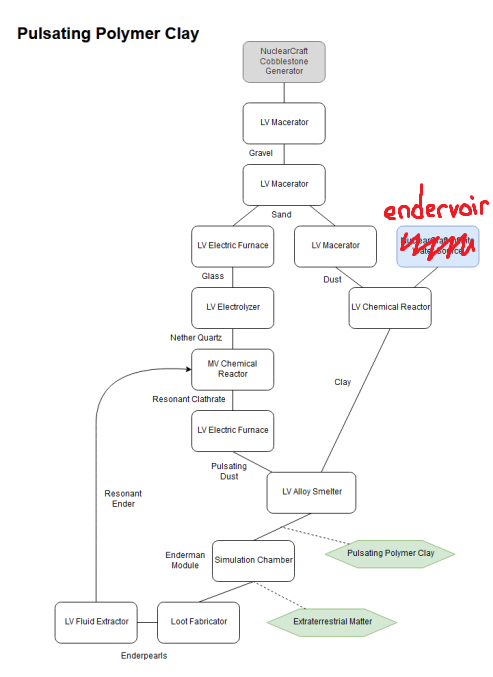

Valid for Omnifactory 1.2.1
# Polymer Clay Automation
Polymer clay is what Simulation Chambers from Deep Mob Learning, the first (and main) way of obtaining infinite basic resources in Omnifactory, need to work. Fully automating production of polymer clay is therefore one of the first automation challenges in the pack. It is recommended that you try and figure out everything about it yourself using JEI, as you'll need that skill throughout the whole pack, but this guide will help you if you're stuck for some reason.

There are currently two possible routes for pulsating dust: the resonant clathrate one, and the enderpearl electrolysis one. The latter needs EV voltage (if it's not clear to you that it's the case from looking at the recipe, read the voltage tier table until you understand) and is generally far slower and power-hungrier, so it isn't really viable at *any* point in the progression. This guide will therefore only consider the former. 

Now that introduction is done, what follows is mostly just other people's guides and flowcharts, with maybe some formatting.
-ConfusedReptile
## Exa's guide
**Raw material sources**:

• NuclearCraft cobblestone generator x2

• Endervoir / Infinite Water Source

• Ender Pearls (grinder, enderman dml, lillies)

**Needed machines**:

• Chemical Reactor (MV+)

• Chemical Reactor (LV+)

• Macerator x5

• Electrolyzer

• Fluid Extractor

• Some manner of smelting (powered furnaces, multi-smelter, whatever you feel like using)

• Alloy Smelter

Setup #1: Clay
Cobble Generator -> Macerator (x3) chain -> Chemical Reactor + Water

Setup #2: Nether Quartz
Cobble Generator -> Macerator (x2) chain -> Smelt sand to glass -> Electrolyzer

Setup #3: Resonant Ender
Pearl Farm -> Fluid Extractor

Setup #4: Resonant Clathrate
Chemical Reactor (MV) + Nether Quartz + Resonant Ender -> Smelt clathrates to pulsating dust

Setup #5: Polymer Clay
Alloy Smelter + Pulsating Dust + Clay

## Flowchart
Author: reddit user u/jakeleebob (Discord tag?)([Original source link](https://www.reddit.com/r/feedthebeast/comments/clv7tt/omnifactory_flow_chart_for_creating_infinite/?utm_source=share&utm_medium=web2x)). Correction in red by Neeve

