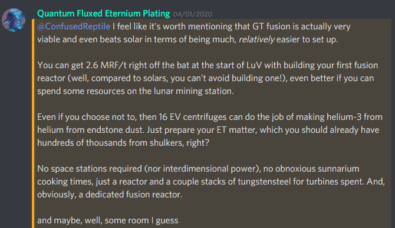

Valid for Omnifactory v.1.2.1
# Omnifactory power generation methods
As CEFs are available, powergen in Omnifactory is almost entirely RF. Power is usually stored in vibrant capacitor banks (they can form multiblocks), and transferred through EnderIO conduits or AE2 power P2P tunnels to (batteryless) CEFs.

**1. Earlygame: steam dynamos**. Two things to know here: 
 1. You can easily grow sugarcane using **snad**(see design below), and use the sugarcane(yes, raw) as fuel for dynamos. See [**Neeve's guide on this**](NeeveSnadGuide.md).
 2. You can use boiler and turbine augments to specialize your dynamos. The ratio is 1 boiler to 2 turbines. This significantly increases both power generation and energy efficiency. Using those two tricks, it will take you as little as 3 dynamos to reach the next (and main) step...

**2. Early MV and until lategame: Numismatic dynamos**. These are without contest the best powergen method in Omnifactory, from whenever you can obtain them (early MV) and until lategame. 
1) Use lapidary conversion augment to feed them diamonds. 
2) Get diamonds from shulker models - yes, that means that the most important thing to do in early MV is completely automating DML. 
3) Fill all other slots with efficiency augments(Fuel Catalyzers).

Useful formula to calculate the proper ratio of numismatic dynamos to Self-Aware shulker models:

`<numis per shulker> = 0.00598*<energy per diamond in RF>/<RF/t of a dynamo>`

Those two stages will last you through most of the pack, until...

**3. Lategame(LuV+): Solars**. 
Once you can mass-produce solars of at least VII-VIII tier, it becomes possible to switch to them entirely. By that point, you'll typically have 500-1000KRF/t of powergen from numis. Solars will last you until creative energy sources.

## Other sources
**Magmatic** is not really worth setting up, as it becomes obsolete almost immediately - there's only a tiny period of time before you can make numismatics. 

**GT power** generation methods are generally massively inferior to numis, except for two:
 - [multiblock diesel engines](DieselEngines.md) fed cetane-boosted diesel - can fulfill the role of numis, but are significantly harder to setup and maintain. 
 - **plasma** turbines (fed with plasma from a Shadows of Greg fusion reactor) - a solid lategame powersource, providing several MRF/t from a reactor, although it's not as easy to scale up as solars. Here's another (Neeve's) opinion: 
 
  

 **Nuclearcraft** is **not** a powergen method in Omnifactory, at all. A lot of players don't even bother collecting the RF the reactors generate with how low-power they are by the time they are obtainable, voiding it instead.
